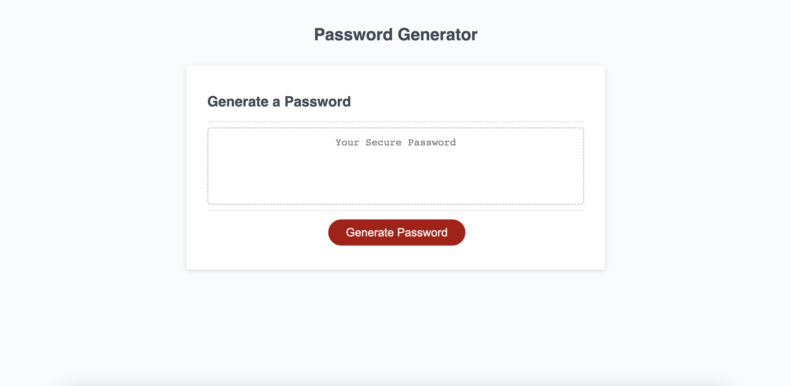

# Password Generator

## Description
This application will allow users to generate random passwords with their own set criteria.

They can customize length between 8-128 characters, as well as choose if they want to include:
- Lowercase characters
- Uppercase characters
- Special characters
- Numbers

The application also has checks to verify that the length is a number between 8-128, that at least one character type is selected, and that at least one character from each selected type will be included in the generated password.

## Deployed Application
The deployed webpage can be found here: https://retrotechcode.github.io/PasswordGenerator/